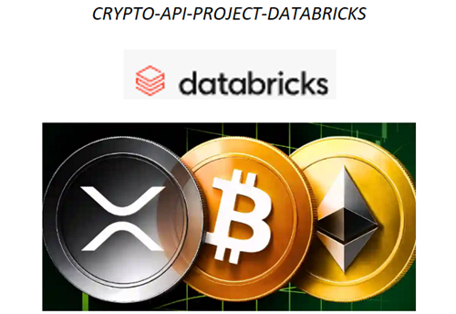

# crypto-api-databricks-project

Dataproject in Databricks with API datasource

Voor dit project heb ik een complete end‑to‑end data‑engineering oplossing ontworpen en gebouwd in Databricks Community Edition,

gebaseerd op het Medallion‑architectuurprincipe (Bronze–Silver–Gold). Het doel van het project was om een externe API‑bron te integreren,

de data te transformeren naar een schaalbaar star schema, en een semantic layer te creëren die direct inzetbaar is voor business‑analyses en Power BI‑dashboards.

Het eindproduct is een Crypto Monitoring Dashboard in Power BI.

In de documentatie staan de technische stappen uitgewerkt om dit te realiseren.

🔧 **Technische scope**

&#x09;• Databricks (Python/PySpark)

&#x09;• Delta Lake

&#x09;• Medallion Architecture

&#x09;• API‑source

&#x09;• Incremental loading dv Stored Procedures

&#x09;• Star schema modelling (facts \& dimensions)

&#x09;• Semantic model voor Power BI

&#x09;• Automation (ETL-pipeline)

&#x09;• Optimize + Z-ordering + Vacuum toepassen

&#x20;       • DAX measures

&#x20;       • PowerBI - Dashboard

Onderstaand de gehele data flow van ingestion tot refreshed PBI dashboard:

┌──────────────────────────────┐

│   Lokaal Python Bestand      │

│  (API-request ophalen data)  │

└──────────────┬───────────────┘

&#x20;              │

&#x20;              ▼

┌──────────────────────────────┐

│       CSV Bestand            │

│     lokaal gegenereerd       │

└──────────────┬───────────────┘

&#x20;              │

&#x20;              ▼

┌──────────────────────────────┐

│ Upload naar Databricks       │

│           Volume             │

└──────────────┬───────────────┘

&#x20;              │

&#x20;              ▼

┌──────────────────────────────┐

│ Pipeline wordt getriggerd    │

│      (Databricks Job)        │

└──────────────┬───────────────┘

&#x20;              │

&#x20;     ┌────────┴────────┐

&#x20;     ▼                 ▼

┌──────────────┐   ┌──────────────┐

│ Silver       │   │ Gold         │

│ Notebook     │──▶│ Notebook     │

│ Opschonen \&  │   │ Business     │

│ Transformeren│   │ Logica       │

└──────┬───────┘   └──────┬───────┘

&#x20;      │                  │

&#x20;      └──────────┬───────┘

&#x20;                 ▼

┌──────────────────────────────┐

│ Semantic Views in            │

│ Databricks SQL Warehouse     │

└──────────────┬───────────────┘

&#x20;              │

&#x20;              ▼

┌──────────────────────────────┐

│     Power BI Dashboard       │

│  Refresh elk uur automatisch │

│   met actuele data uit       │

│      semantic\_views          │

└──────────────────────────────┘

